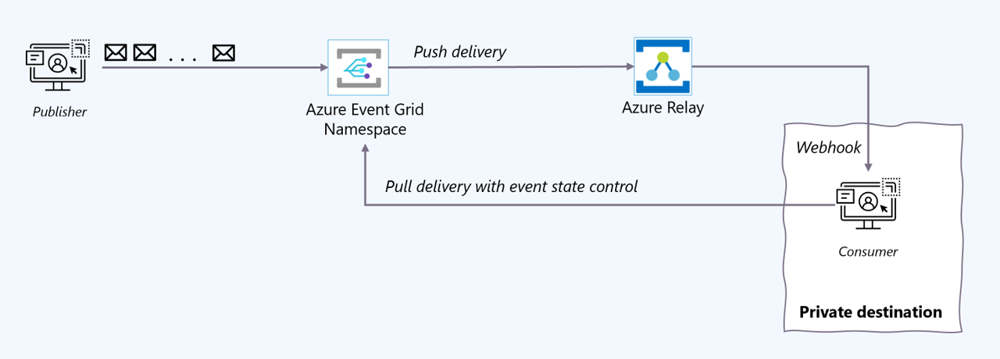
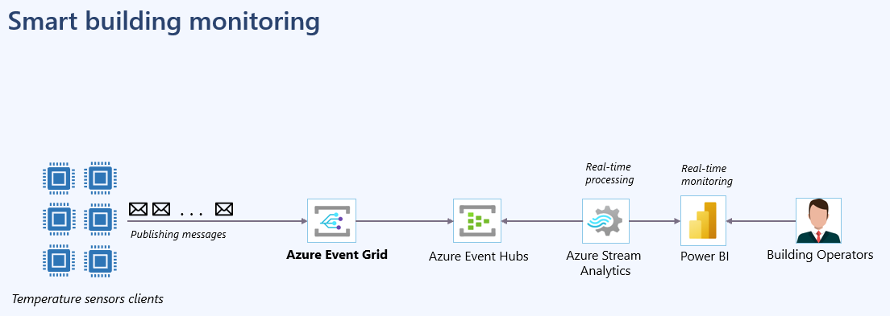

# Event Grid PreIgnite 2023

Demos available in this repository:

1. Push/Pull delivery.

    

2. MQTT Broker.

    

Instructions to create a client certificate for testing.

1. Open a terminal.
2. Go to source\CertificateGeneration.
3. run: *sh certgen.sh create_root_and_intermediate*.

    ```text
    Output:
    
    Certs generated by this script are not for production (e.g. they have hard-coded passwords of '1234'.
    This script is only to help you understand Azure Mqtt CA Certificates.
    Use your official, secure mechanisms for this cert generation.
    Also note that these certs will expire in 30 days.
    Certs generated by this script are not for production (e.g. they have hard-coded passwords of '1234'.
    This script is only to help you understand Azure Mqtt CA Certificates.
    Use your official, secure mechanisms for this cert generation.
    Also note that these certs will expire in 30 days.
    ```

4. run: *sh certgen.sh create_leaf_certificate_from_intermediate [clientName]*.

    ```text
    Example:
    sh certgen.sh create_leaf_certificate_from_intermediate preIgnite2023
    ```

    ```text
    Output:
    
    Certs generated by this script are not for production (e.g. they have hard-coded passwords of '1234'.
    This script is only to help you understand Azure Mqtt CA Certificates.
    Use your official, secure mechanisms for this cert generation.
    Also note that these certs will expire in 30 days.
    ```

5. Replace the following files in the folder source\MQTTBroker\certs\.
    - azure-mqtt-test-only.root.ca.cert.pem
    - preIgnite2023.cert.pem
    - preIgnite2023.key.pem

6. Congratulations! you are all set for the MQTTBroker application.
